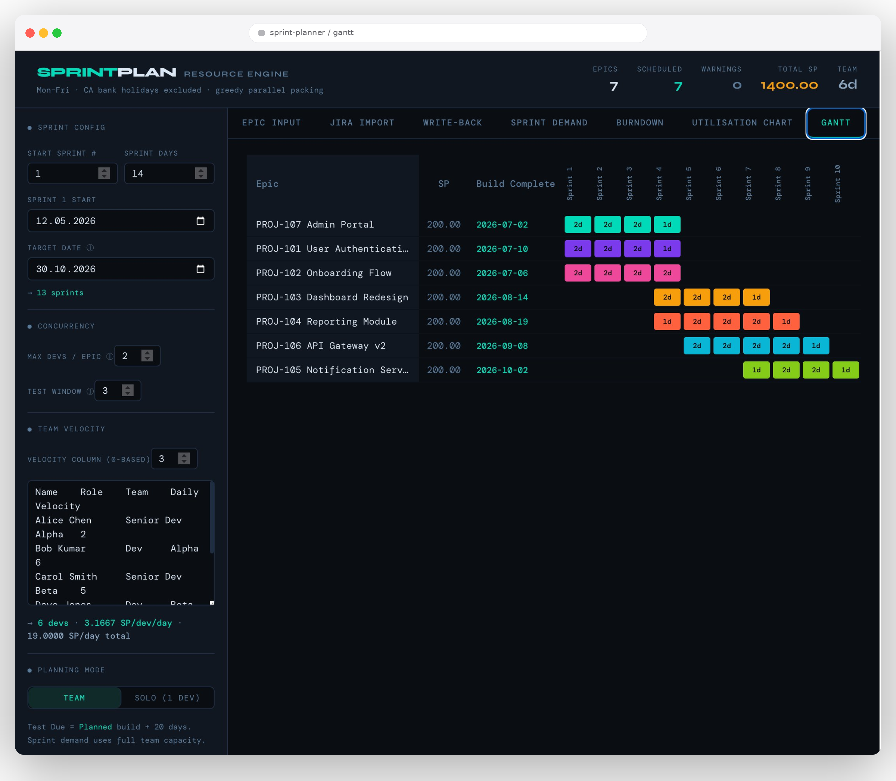
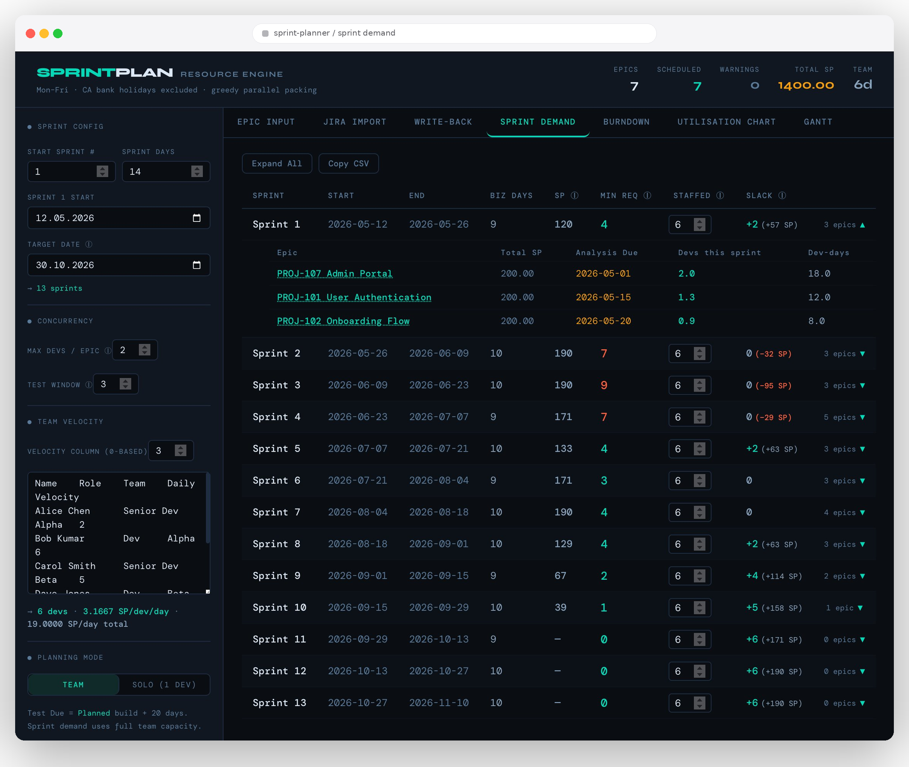
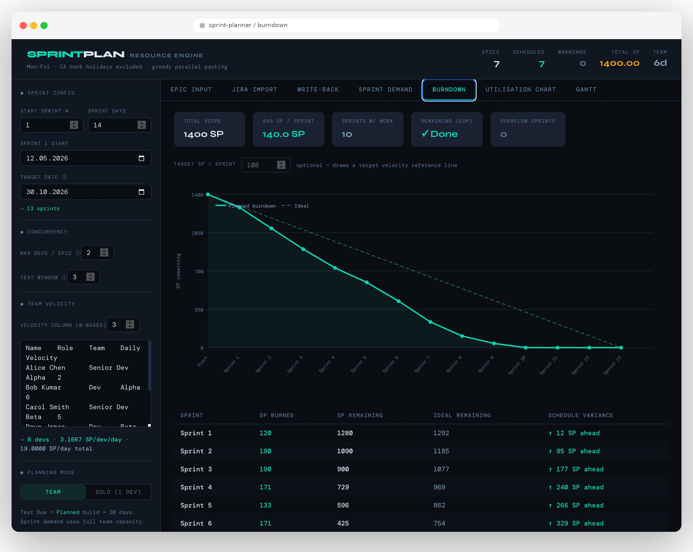

# sprint-planner

A React + Vite sprint planning tool for technical PMs and delivery managers — built to answer the questions that come up at every quarterly planning session: *can we hit this date with this team?*, *how much over-staffed are we in sprint 5?*, *which epic is going to slip if we don't add a dev?*

It pulls epics and stories from Jira, packs them across sprints with a concurrency-aware greedy algorithm, surfaces under- and over-staffing per sprint, and writes the calculated dev/test due dates back to Jira in one click.

---

## Highlights

### 📊 Gantt — see the full plan at a glance
Color-coded epic blocks across the planned sprint range, sized by dev-days per sprint. Every block respects the per-epic concurrency cap, the Analysis Due gate, Canadian bank holidays, and the team's daily SP velocity — so what you see is genuinely shippable, not aspirational.



### 🎯 Sprint Demand — reverse planning with staffing gap detection
Set a target date instead of a sprint count. The engine computes the *minimum* devs needed per sprint to land on time (an uncapped plan), then compares that against your actual staffed headcount sprint-by-sprint. Green Slack = surplus capacity, red Slack = guaranteed slippage.

The killer feature: editing *Staffed* in any sprint immediately re-runs the plan. Every Planned Dev Due date and Gantt block updates reactively across all tabs, so you can negotiate a staffing change with engineering leadership and watch the impact land in real time.



### 📉 Burndown — variance against the ideal pace
Planned cumulative burn vs. an ideal linear line, with an optional target-velocity reference. Per-sprint variance ("ahead/behind" SP) makes it obvious which sprint is the fulcrum — usually the one where staffing drops or three epics analysis-gate-open simultaneously.



---

## Why this exists

Generic Jira plugins answer "what's in the backlog." They don't answer "if we want to ship by October 30th, how many devs do we need in each sprint, which epics will land in which sprint, and what does the burndown look like?"

The PM workflow this replaces:
1. Export Jira to Excel
2. Build a manual sprint matrix with `=SUMIFS` formulas
3. Re-do it every time staffing changes or scope shifts
4. Manually copy the dates back into Jira ticket-by-ticket

sprint-planner does all of that in the browser, reactively, with the dates round-tripping through the Jira REST API.

---

## Stack

- **React 19** + **Vite 8** — single-page app, no UI library
- **Vitest** — 118 passing unit tests covering the planning engine
- **Python proxy** (Flask + flask-cors + requests) — local-only, handles the Jira CORS dance and bearer token

## Getting started

```bash
npm install
npm run dev
```

Jira import requires the local proxy:

```bash
pip install flask flask-cors requests
python proxy.py
```

## Running tests

```bash
npm test
```

---

## Planning engine

- **Sprint-centric greedy packing** — outer loop iterates sprints, inner loop iterates epics sorted by analysis due date. Freed capacity from the per-epic concurrency cap is immediately absorbed by the next epic in the queue.
- **Per-epic concurrency cap** (`Max Devs / epic`) — global default (sidebar), overridable per epic in the Epic Input tab. Prevents unrealistic swarming.
- **Per-sprint staffing overrides** — each sprint's headcount is individually editable in the Sprint Demand tab.
- **Reverse planning** — set a target date instead of a sprint count. The app computes how many sprints fit and shows a *Min Req* curve (minimum devs needed per sprint from an uncapped plan) alongside your *Staffed* headcount so you can see the gap at a glance.
- Excludes Canadian federal bank holidays and weekends from all business-day calculations (2025–2027).
- Supports mixed date input formats: `YYYY-MM-DD`, `M/D/YYYY`, `D-Mon`, etc.

## Jira integration

- **Import** epics and stories from Jira via the local proxy — pulls SP, analysis/dev/test due dates, Fix Version, POD, and story breakdown.
- **Write-back** — push calculated Dev Due and Test Due dates back to Jira stories individually or in bulk.
- Always uses story sum SP (ignores epic-level SP estimate) — because epic estimates lie and story sums don't.

---

## Tabs

### Epic Input
Paste TSV from Excel or edit inline. Epics are sorted by analysis due date (oldest first, blanks last).

| Column | Description |
|--------|-------------|
| SP | Story points (summed from Jira stories on import) |
| Max Devs ⓘ | Per-epic concurrency cap override |
| Analysis Due | Date analysis is complete — epics are not scheduled before this |
| Fix Version | Jira fix version (display only) |
| Full Focus | Theoretical best-case date if the whole team swarms this epic |
| Solo Dev Due Date | Date if one average dev worked it alone |
| Planned Dev Due Date | Realistic date from the team plan |
| Test Due Date | Planned Dev Due + configurable test window (default 6 wks) |
| Devs | Peak devs allocated in any single sprint |
| Sprint(s) | Sprints this epic is scheduled across |
| POD | Jira POD field |

### Sprint Demand
*Pictured above.* Reverse-planning view — set a target date, see where you're under- or over-staffed sprint by sprint.

| Column | Description |
|--------|-------------|
| Min Req ⓘ | Minimum devs needed to avoid slippage (from uncapped plan) |
| Staffed ⓘ | Your planned headcount — edit inline per sprint |
| Slack | Staffed − Min Req (red = understaffed, green = surplus) |

Editing *Staffed* immediately reruns the plan — Planned Dev Due dates and sprint assignments update reactively across all tabs.

### Burndown
*Pictured above.* Cumulative scope burn across sprints relative to the target date.

| Element | Description |
|---------|-------------|
| Planned burndown | Solid line showing SP remaining after each sprint based on the team plan |
| Ideal line | Dashed reference line for perfectly linear burn from total SP → 0 |
| Target velocity line | Optional amber line — enter a uniform SP/sprint target to see where that pace lands |
| Overflow marker | Vertical dashed line at the target date boundary; overflow sprints shown in red |
| Schedule variance | Per-sprint table column: how many SP ahead or behind the ideal pace |

Stats strip shows total scope, average SP/sprint, remaining SP at end-of-plan, and overflow sprint count.

### Other tabs

| Tab | Description |
|-----|-------------|
| Jira Import | Import epics/stories from Jira, configure proxy URL and auth |
| Write-back | Review and push calculated dates back to Jira |
| Utilisation Chart | Visual bar chart of team utilisation per sprint |
| Gantt | *Pictured above.* Timeline view of epic scheduling across sprints |

---

## Sidebar — Sprint Config

- **Start sprint #** — label offset for sprint numbering
- **Sprint days** — sprint length in calendar days (default 14)
- **Sprint 1 start** — calendar date of the first sprint
- **Target date** — planning horizon; sprint count is auto-computed as `⌈(target − start) / sprintDays⌉`
- **Team size** and **velocity** inputs
- **Max devs / epic** — global concurrency cap
- **Test window** — business weeks allocated for testing after build complete (default 6)

## Session persistence

All inputs are automatically saved to `localStorage` (`sp_session_v1`) on a 400 ms debounce and restored on page refresh. This covers epics, team roster, sprint config, Jira settings, staffing overrides, story map, and all planning mode flags. The bearer token is intentionally excluded.

A **Reset to defaults** button (double-confirm) in the sidebar clears the saved session and reloads to the built-in sample data.

## Epic input format (paste from Excel)

Columns: **Epic Name / ID · SP · Analysis Due**

```
PROJ-1234    12    3/27/2026
PROJ-5678    5     2026-04-15
```

Additional columns (Max Devs, Fix Version) can be included or left blank.

## Team velocity format (paste from Excel)

```
Name      Role    Location    Velocity
Alice     Dev     Canada      0.475
Bob       Dev     Canada      0.226
```

## Notes

- Holidays covered: 2025–2027 Canadian federal bank holidays
- Epic SP always derived from story sum (epic estimate ignored)
- Jira custom field IDs (Epic Link, SP, Analysis Due, Dev Due, Test Due, Product, POD) vary per Jira instance — update the constants in `src/epicGrouping.js` to match your setup
